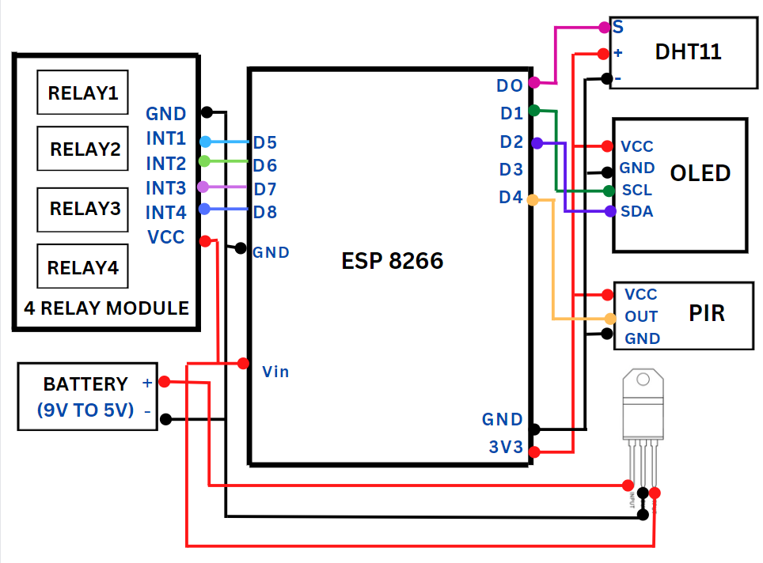

# Home-Automation

This project enables you to control various aspects of your home automation system using the Telegram messaging platform. With the help of a Telegram bot, you can conveniently manage and monitor your smart devices, such as lights, appliances, thermostats, and more, from anywhere with an internet connection.

## Features
Control smart devices through Telegram commands
-Receive real-time updates and notifications
-Monitor device status 
-Secure communication using Telegram's end-to-end encryption

## Prerequisites
Before setting up the home automation system, make sure you have the following:

-A Telegram account
-Telegram app installed on your smartphone or computer
-A stable internet connection
-Arduino board (e.g., Arduino Uno, Arduino Mega)
-Relay module (this project uses 4 relay module)
-DHT11 temperature and humidity sensor
-OLED display
-PIR (Passive Infrared) motion sensor
-Jumper wires
-Breadboard (optional)

## Circuit Diagram
Here is a basic circuit diagram to help you connect the components:

## Installation
1.Connect the components according to the circuit diagram. Make sure to provide the necessary power supply and ground connections.

2.Install the required libraries for the DHT11 sensor, OLED display, and PIR sensor. You can use the Arduino Library Manager to install the libraries:
-DHT sensor library by Adafruit
-Adafruit SSD1306 library
-Adafruit GFX library

3.Download the Arduino sketch file (home_automation_telegram.ino) from this repository.

4.Open the downloaded sketch file in the Arduino IDE.

5.Configure the following settings in the sketch file:
-Telegram Bot Token: Replace YOUR_TELEGRAM_BOT_TOKEN with the API token of your Telegram bot.
-Wi-Fi Credentials: Replace YOUR_WIFI_SSID and YOUR_WIFI_PASSWORD with your Wi-Fi network credentials.

6.Upload the sketch to your Arduino board.

7.Once the upload is complete, open the Arduino Serial Monitor to view the IP address assigned to your Arduino board. Make a note of this IP address.

8.Search for your Telegram bot username in the Telegram app and start a chat with the bot.

9.Send the /start command to the bot and follow the instructions to authenticate your Telegram account.

10.You can now start controlling your smart devices using Telegram commands.

## Usage
The Telegram bot understands the following commands:

-**/turnon <device>**: Turns on the specified device.

-**/turnoff <device>**: Turns off the specified device.

-**/getstatus <device>**: Retrieves the current status of a device.

-**/gettemperature**: Retrieves the current temperature and humidity readings from the DHT11 sensor.

-**/getsensorstatus**: Retrieves the current status of the PIR motion sensor.

Replace <device> with the name or identifier of your specific smart device.

You can customize and extend the commands based on your specific smart devices and home automation system.

## Contributing
Contributions are welcome! If you encounter any issues or have suggestions for improvements, please open an issue or submit a pull request.

## License
This project is licensed under the MIT License.

## Disclaimer
Please use this home automation system responsibly and ensure the security of your smart devices and personal data. 
